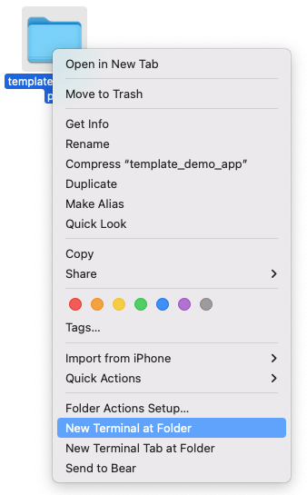
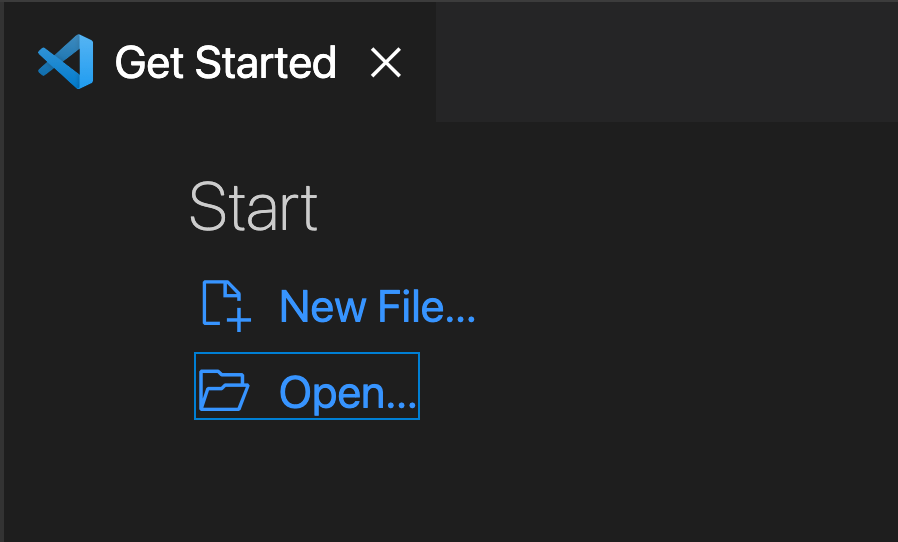
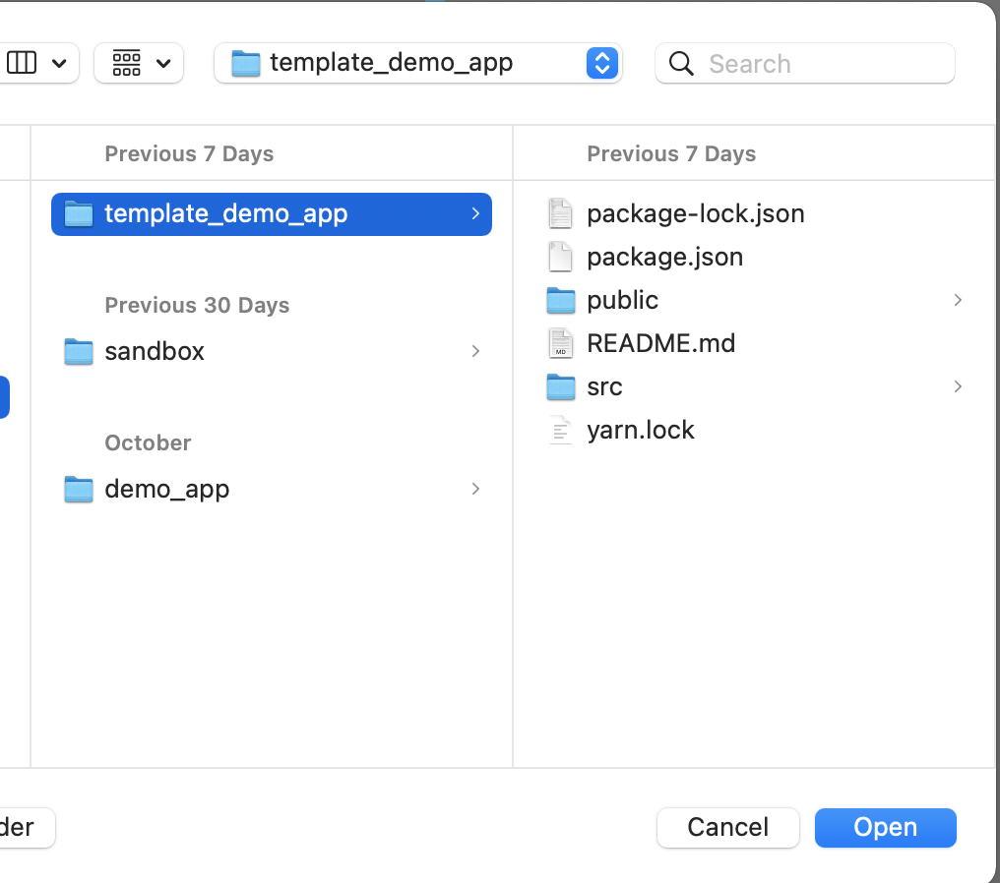
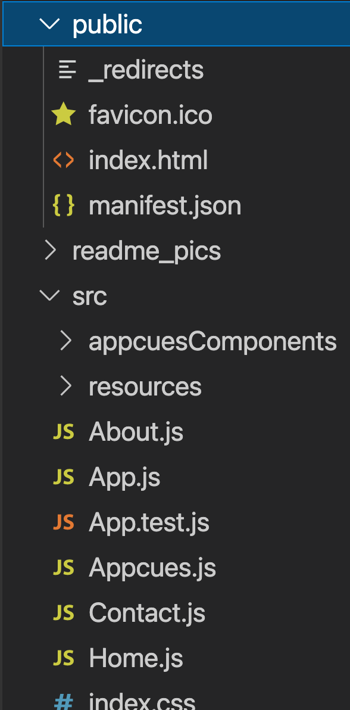
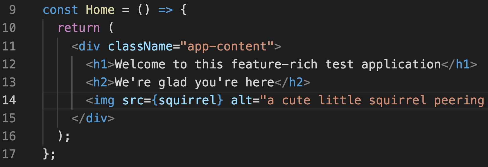
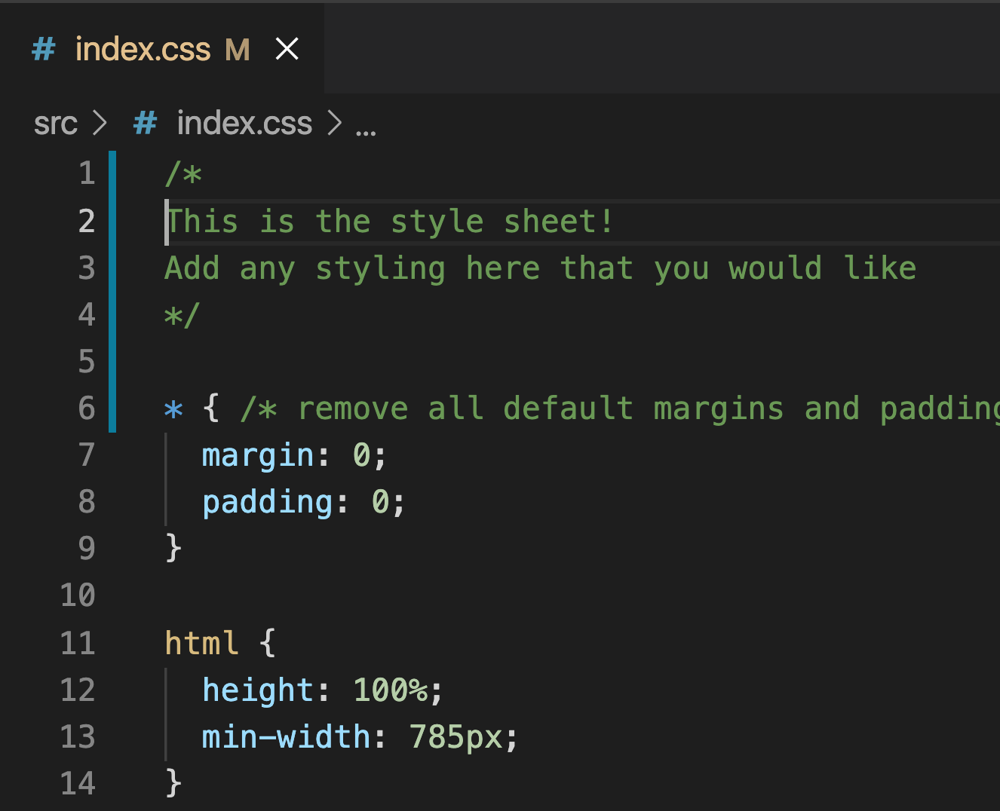

# Directions for using this demo app

In order to work with this app, you'll do most of your work from your computer's terminal. If you're unfamiliar with the terminal, [this article](https://itconnect.uw.edu/learn/workshops/online-tutorials/web-publishing/what-is-a-terminal/) gives a quick rundown. For basic terminal commands, check out [this Tech Republic article](https://www.techrepublic.com/article/16-terminal-commands-every-user-should-know/). The commands **cd**, **pwd**, and **ls** are particularly useful.

If you'd like to see a working version of this app, check out https://elijah-demo-app.netlify.app/

## Pre-set up

If this is your first time working with code, you may need to first install a few other things to get started. If you've done dev work in the past, you might have already installed these.

What you need: 

### 1. Homebrew

If using Mac, I recommend first making sure [Homebrew](https://brew.sh/) has been installed on your machine. You can check whether or not it's installed by typing `which brew` in your terminal. If it's installed, it should give you a local path that points to where it's been installed, something like `/usr/local/bin/brew`.

### 2. Git

Git is an open source distributed version control system designed to handle everything from small to very large projects with speed and efficiency. If you're interested in learning more about it, check out [What is Git](https://git-scm.com/book/en/v2/Getting-Started-What-is-Git%3F). You're welcome to use an alternative to Git and Github if you prefer, but here's how to get started with Git.

Open your computer terminal and install Git. With Homebrew installed, you can do this with the terminal command `brew install git`. You can check if you already have Git installed with the command `git version`. For more detailed install instructions, check out [Github's documentation](https://github.com/git-guides/install-git). 

You'll also want to make sure to register for an account on [Github](https://github.com/).

### 3. Node.js and npm

Node.js is a big beautiful thing, and if you're interested, check out [their about page](https://nodejs.org/en/about/). For the purposes of this project, we're mainly interested in [npm](https://en.wikipedia.org/wiki/Npm_(software)), which is a package manager that generally comes bundled with Node.js.

Install Node.js with the command `brew install node` or `brew install node@version_number` (recommended). This will also install npm. The first will install the latest released version of node, while the second will allow you to install whichever version you'd like. I recommend installing the most up-to-date stable version of Node, which you can find on [Node's website](https://nodejs.org/en/).

### 4. VSCode

[Visual Studio Code](https://code.visualstudio.com/) is a powerful code editor with a ton of functionality. This allows you to open up all your code files and make edits as you please. There are a lot of other great code editors like [Atom](https://atom.io/) or [Sublime Text](http://www.sublimetext.com/), so feel free to use whatever suits your fancy. 

## App set up

Now that you've installed the above, it's time to get your demo app up and running!

### 0. Learn how to navigate around the terminal

Whenever you're trying to work on a project, you need to make sure you're in the correct location inside the terminal. When you open up a fresh instance of a terminal, by default it opens to your current user's root directory. 

**A word of caution: the terminal makes the assumption that you know what you're doing and you mean anything that you type into it. If you tell it to delete a file, it won't ask if you're sure. This means it's possible to seriously break things in your computer if you're not careful. That said, the following terminal commands are all mostly harmless.**

To open a terminal, open your Spotlight Search and type `terminal` or select it from your list of applications. 

Type `pwd` to see what your current path is.

---

#### Terminal commands:

- **Return to your root directory: `cd`**

The **c**hange **d**irectory command, by itself, returns you to `Users/username`. Very useful if you navigate deep into a file tree.

- **Go up a level: `cd ..`**

If you're at `Users/username/desktop/project`, change directory to `Users/username/desktop`.

- **Go up 2 levels: `cd ../..`**

If you're at `Users/username/desktop/project`, change directory to `Users/username`.

- **Go up 3 levels: `cd ../../..`**

If you're at `Users/username/desktop/project`, change directory to `Users`.

- **Go down a level: `cd <folder-name>`**

If you're at `Users/username`, `cd desktop` will change directory to `Users/username/desktop`.

- **Go down 2 levels: `cd <folder>/<sub-folder>/`**

If you're at `Users/username`, `cd desktop/project` will change directory to `Users/username/desktop/project`.

- **See your current location: `pwd`**

If you ever forget where you are, **p**rint **w**orking **d**irectory!

- **See contents at your current location: `ls`**

Generally the first thing I do after changing directory is **l**i**s**t the files so I can see what's there.

Alternately, if you want to simply open your terminal to the correct path right away, right click on the project folder and select `new Terminal at Folder`.

In the new terminal that opens, you can type `pwd` to see where in your computer you're located. It will look something like this:

---

**Whenever you're running any of the below commands, it is assumed your terminal's working directory is the folder where your project is located unless stated otherwise**

Now that you know some basics of terminal use, it's time to actually get started with your project! 

### 1. Clone this repo

In the terminal, navigate to the folder where you'd like to save your project and then clone this project repository to your computer using the `git clone` command. For directions on how to use this command, check out [this article](https://docs.github.com/en/repositories/creating-and-managing-repositories/cloning-a-repository).

For example, if you'd like to create a project folder on your desktop, you would want your working directory in the terminal to be `Users/username/desktop`. Then, when cloning this repository to your machine, it will create a new folder on your desktop titled `appcues_demo_app`.

After cloning the repo, you can then change directory with `cd appcues_demo_app`.

Following this example, if you print your working directory, you should now be located at `Users/username/desktop/appcues_demo_app`.

### 2. Install dependencies

Run `npm install` to install other project dependencies.

### 3. Start local server

Run `npm start` to begin a local development server. Once this starts, you should be able to see a live preview of your app running in your browser at `localhost:3000`. [^1]

[^1]: you will first need to install Appcues using your account ID in the second step below.

And that's it! You've now got a locally hosted working app. Any changes you make in your code files should automatically appear in the local version of your demo app.

## Personalize app

### 1. Open your app in your code editor

If using VSCode:

1. In the Get Started tab in VSCode, select **Open**.

2. Choose your project folder and open the entire thing. This will open all the project files in VSCode. You will see all of them listed in the left side of the editor. You can even read these directions there by opening the README.

### 2. Set Appcues account ID

1. Click the `public > index.html` file. This will display the contents of the file for editing. Replace {account_id} in the Appcues snippet with your Appcues account ID. Make sure you save the changes with `CMND + S`. 

### 3. Set user ID (optional)

1. In `src > App.js`, on the line of code `window.localStorage.setItem("currentUser", "testUser")`, replace the "testUser" ID to a different value if you'd like. This is the fallback ID that will be used the first time you load the app, as well as anytime you click the Appcues.reset() button in the toolbar. 

2. You can also add in any other user properties you would like sent into Appcues into the Appcues.identify() call in this file. By default, this currently includes two properties: role and signupDate (a date property).

### 4. Personalize app content (optional)

Feel free to add any additional HTML you would like. This should mostly be done with HTML added into the `return` section of any component. You can add in anything like photos, iFrames, lists, etc. You can also create entirely new components if you're feeling adventurous.

Everything in the return section should be wrapped inside a single element. In this example, everything is wrapped by the div with the class of **app-content**.

### 5. Add CSS (optional)

The app's CSS lives in `src > index.css` and can be changed as you please. 

Note: I recommend leaving alone the files in the `appcuesComponents` folder, as these are what are used for making calls to the Appcues javascript API and running the event log.

## Push project to Github

You now have a working app, but it's currently only on your machine. Next you'll want to push the code to Github.

When working in the terminal, you'll want to make sure you're in your demo project folder. If you're running a local server for local host, I recommend opening a second terminal for pushing changes to Github.

### Create your Github repository

#### change this to only use change origin,  say it's an empty repo
Following the [directions](https://docs.github.com/en/get-started/quickstart/create-a-repo) on Github, create a new repository to hold your demo app's files. You don't need to create a new README, gitignore, or license. You'll want to follow the steps for pushing an existing repository from the command line, with one small change:

`git remote set-url origin <repo_url>` instead of `git remote add origin <repo_url>`
`git branch -M main`
`git push -u origin main`

The first time you try to push code from your computer to Github, you will need to verify your Github credentials. In the terminal, it will ask for first your username, and then your password. Your username is straightforward enough. 

Earlier this year, however, Github changed its verification requirements from password to token-based (check out [this article](https://github.blog/2020-12-15-token-authentication-requirements-for-git-operations/) if you're interested in reading more about it). Long-story short, instead of using your password here, you will first need to generate a personal access token following [these directions](https://github.blog/2020-12-15-token-authentication-requirements-for-git-operations/). Once you have your token, paste it into the password field prompt in your terminal. Note that the characters entered into this field are invisible.
When you visit your repo page in Github, you should now see all your files present. Whenever you make any changes to the files, you'll want to make sure to push all these changes to the Github-hosted version so they match up. The 3 basic commands you'll want to use are:

### 1. `git add .` 

This will add any file that has been changed to your staging area.

### 2. `git commit -m "<message here>"` 

This commits the changes, sort of like a quick save. The message you enter will appear in Github. It's common practice to write these comments in short imperatives like "add login functionality" to give you a quick description of what changes you made. These comments will appear in Github. You can commit as many times as you want before pushing your code changes. It's a good rule to commit early and often. 

### 3. `git push origin main` 

This pushes all your committed files to Github.

### 4. `git status` 

This command will give you a list of files that have been modified and need to be staged, as well as committed. 

Note: these are just the very basics of Git. For a more complete rundown, [this article](https://www.freecodecamp.org/news/practical-git-and-git-workflows/) from freeCodeCamp is a great place to start.

## Host project on Netlify

Now that your app is saved on Github, the last step is to host it somewhere so that you can access it from anywhere! Although there are many, many ways to do this, this app is currently configured to use Netlify. 

1. Create an account at [Netlify](https://www.netlify.com/).

2. Follow the steps in [this article](https://www.netlify.com/blog/2016/09/29/a-step-by-step-guide-deploying-on-netlify/).

3. You should now have a working demo app with Appcues installed!
